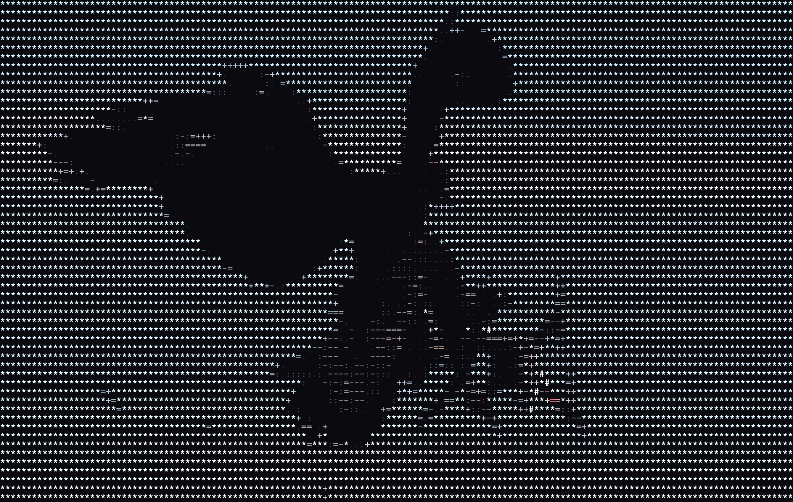

# Sky-Spy

<p align="center">
  
</p>

**Official OUI-SPY firmware for drone RemoteID detection and mapping**

Sky-Spy is one of the official firmware options for the [OUI-SPY hardware platform](https://github.com/colonelpanichacks/OUI-SPY). This specialized firmware detects and tracks drones broadcasting RemoteID via WiFi and Bluetooth Low Energy, outputting real-time JSON data for visualization with mesh-mapper.py.

## OUI-SPY Firmware Family

Sky-Spy is part of the OUI-SPY firmware ecosystem:
- **[OUI-SPY Detector](https://github.com/colonelpanichacks/ouispy-detector)** - Multi-target BLE scanner with OUI filtering
- **[OUI-SPY Foxhunter](https://github.com/colonelpanichacks/ouispy-foxhunter)** - Precision proximity tracker for radio direction finding
- **[OUI-SPY UniPwn](https://github.com/colonelpanichacks/Oui-Spy-UniPwn)** - Unitree robot exploitation system
- **[Flock You](https://github.com/colonelpanichacks/flock-you)** - Flock Safety surveillance camera detection
- **[Sky-Spy](https://github.com/colonelpanichacks/Sky-Spy)** - Drone RemoteID detection (this firmware)

**What Makes Sky-Spy Different:**
- Targets OpenDroneID protocol (ASTM F3411) instead of general BLE devices
- WiFi promiscuous mode scanning for WiFi-based RemoteID broadcasts
- JSON output format for mesh-mapper.py real-time visualization
- Extracts GPS coordinates, altitude, speed, heading from drone telemetry
- Tracks operator/pilot location and drone identification
- Multi-drone tracking (up to 8 simultaneous)

Like all OUI-SPY firmware, Sky-Spy features audio alerts with a non-blocking buzzer implementation running on a dedicated FreeRTOS task.

## Hardware Requirements

### OUI-SPY Board (Recommended)
**Get the official hardware:** [Tindie](https://www.tindie.com) | [colonelpanic.tech](https://colonelpanic.tech)

The OUI-SPY board is a ready-to-use ESP32-S3 platform with:
- Integrated buzzer with PWM control
- Built-in antenna with external antenna option
- USB-C power and programming
- Compact PCB design with sick artwork
- No additional components required

### Compatible Development Boards
- **Seeed Studio XIAO ESP32-S3** (Primary)
  - ESP32-S3 dual-core MCU @ 240MHz
  - 8MB Flash, 8MB PSRAM
  - WiFi & Bluetooth 5.0 (LE)
  - USB-C connectivity
  
- **Seeed Studio XIAO ESP32-C6** (Alternative)
  - ESP32-C6 RISC-V MCU
  - WiFi 6 & Bluetooth 5.3 (LE)

### Buzzer Connection
- **Pin:** GPIO3 (D2) - PWM capable
- **Type:** Passive buzzer (requires PWM signal)
- **Connection:** Buzzer positive to GPIO3, negative to GND
- **Optional:** Add 100Ω resistor in series for volume control

## Features

### Drone Detection
- **Dual-Protocol Scanning:**
  - WiFi promiscuous mode (802.11 beacon/probe frames)
  - Bluetooth Low Energy (BLE) advertisements
- **OpenDroneID Protocol Support:**
  - Basic ID (drone serial/CAA registration)
  - Location data (GPS coordinates, altitude, speed, heading)
  - System data (operator location)
  - Operator ID
- **Multi-Drone Tracking:** Simultaneously track up to 8 drones

### Audio Alerts (Non-Blocking)
- **Detection Alert:** 3 quick high-pitched beeps (1000 Hz) on first detection
- **Heartbeat:** Double beep (600 Hz) every 5 seconds while drone is in range
- **Auto-Stop:** Heartbeat stops after 7 seconds with no drone detected
- **Zero Latency:** Dedicated FreeRTOS task ensures buzzer never delays detection

### Thread-Safe Architecture
- **ISR-Safe Design:** All callbacks use critical sections for atomic flag updates
- **Race-Free Operation:** Mutex protection for all shared variables
- **Dual-Core Utilization:**
  - **Core 0:** WiFi promiscuous mode packet processing
  - **Core 1:** BLE scanning, JSON output, buzzer control

## Installation

### Prerequisites
1. **PlatformIO IDE** (VS Code extension) or **PlatformIO Core**
2. **USB-C cable** for programming and serial communication
3. **Passive buzzer** (optional, for audio alerts)

### Setup Steps

1. **Clone or download this repository**
   ```bash
   cd /path/to/remoteid-mesh-dualcore
   ```

2. **Install dependencies** (automatic via PlatformIO)
   ```bash
   pio pkg install
   ```

3. **Build firmware**
   ```bash
   # For ESP32-S3 (recommended)
   pio run -e seeed_xiao_esp32s3
   
   # For ESP32-C6
   pio run -e seeed_xiao_esp32c6
   ```

4. **Flash to device**
   ```bash
   # Auto-detects USB port
   pio run -e seeed_xiao_esp32s3 -t upload
   ```

5. **Monitor serial output**
   ```bash
   pio device monitor -e seeed_xiao_esp32s3
   ```

## Usage

### Serial Output Format

The device outputs JSON data at **115200 baud** via USB serial. Each detected drone generates:

```json
{
  "mac": "aa:bb:cc:dd:ee:ff",
  "rssi": -45,
  "drone_lat": 37.7749,
  "drone_long": -122.4194,
  "drone_altitude": 120,
  "pilot_lat": 37.7750,
  "pilot_long": -122.4195,
  "basic_id": "1234567890ABCDEF"
}
```

### Field Descriptions
- `mac`: Drone's MAC address (WiFi or BLE)
- `rssi`: Signal strength in dBm (closer = higher)
- `drone_lat/drone_long`: Current drone GPS coordinates
- `drone_altitude`: Altitude above mean sea level (meters)
- `pilot_lat/pilot_long`: Operator/takeoff location
- `basic_id`: Drone serial number or registration ID

### Status Messages
```json
{"   [+] Device is active and scanning..."}
```
Sent every 60 seconds to confirm device operation.

### Integration with mesh-mapper.py

This scanner is designed as a USB serial data source for the mesh-mapper.py visualization tool:

1. **Connect scanner** via USB
2. **Run mesh-mapper.py** with appropriate serial port:
   ```bash
   python mesh-mapper.py --port /dev/cu.usbmodem1101
   ```
3. **View real-time drone positions** on the map interface

## Audio Alert Behavior

### Detection Sequence
1. **Drone detected** → 3 quick beeps (150ms each @ 1000 Hz)
2. **Stays in range** → Double beep every 5 seconds (100ms each @ 600 Hz)
3. **Out of range** → Heartbeat stops after 30 seconds of no detection

### Disabling Buzzer
To disable audio alerts, comment out line 377 in `main.cpp`:
```cpp
// xTaskCreatePinnedToCore(buzzerTask, "BuzzerTask", 4096, NULL, 1, NULL, 1);
```

## Technical Details

### Detection Methods

**WiFi Promiscuous Mode:**
- Listens on channel 6 (WiFi RemoteID standard channel)
- Captures beacon frames and probe requests
- Parses OpenDroneID NAN action frames
- Extracts vendor-specific information elements

**BLE Scanning:**
- Active scanning with 100ms interval
- Monitors ASTM F3411 RemoteID advertisements
- Service UUID: 0xFFFA (RemoteID identifier)
- 1-second scan duration with continuous operation

### Memory Usage
- **RAM:** 21.0% (68,928 / 327,680 bytes)
- **Flash:** 42.9% (1,433,678 / 3,342,336 bytes)
- **Stack Sizes:**
  - BLE Task: 10KB
  - WiFi Task: 10KB
  - Printer Task: 10KB
  - Buzzer Task: 4KB

### FreeRTOS Task Architecture

```
Core 0:                         Core 1:
┌──────────────────┐           ┌──────────────────┐
│ WiFi Process     │           │ BLE Scan Task    │
│ (Channel 6)      │           │ (1s intervals)   │
└────────┬─────────┘           └────────┬─────────┘
         │                              │
         └────────────┬─────────────────┘
                      │
            ┌─────────▼──────────┐
            │  ISR Callbacks     │
            │  (Set Flags)       │
            └─────────┬──────────┘
                      │
         ┌────────────┼────────────┐
         │            │            │
    ┌────▼─────┐ ┌───▼──────┐ ┌──▼────────┐
    │ Printer  │ │ Buzzer   │ │ Main Loop │
    │ Task     │ │ Task     │ │ (Monitor) │
    └──────────┘ └──────────┘ └───────────┘
```

## Development

### Project Structure
```
remoteid-mesh-dualcore/
├── src/
│   ├── main.cpp           # Main application code
│   ├── opendroneid.h      # OpenDroneID protocol definitions
│   ├── opendroneid.c      # Protocol parsing functions
│   ├── odid_wifi.h        # WiFi-specific RemoteID structures
│   └── wifi.c             # WiFi helper functions
├── include/               # Additional headers (empty by default)
├── lib/                   # Project-specific libraries (empty by default)
├── test/                  # Unit tests (empty by default)
├── platformio.ini         # Build configuration
└── README.md              # This file
```

**Note:** Build artifacts (`.pio/`, `*.bin`, `*.elf`) are automatically generated during compilation and should not be committed to version control.

### Building for Different Boards

**ESP32-S3 (Default):**
```bash
pio run -e seeed_xiao_esp32s3 -t upload
```

**ESP32-C6:**
```bash
pio run -e seeed_xiao_esp32c6 -t upload
```

### Customization

**Change Buzzer Pin:**
Edit line 21 in `main.cpp`:
```cpp
#define BUZZER_PIN 3  // Change to your desired GPIO
```

**Adjust Heartbeat Interval:**
Edit line 397 in `main.cpp`:
```cpp
if (current_millis - last_heartbeat >= 5000) {  // Change 5000 to desired ms
```

**Modify Beep Frequencies:**
Edit lines 24-27 in `main.cpp`:
```cpp
#define DETECT_FREQ 1000      // Detection alert frequency (Hz)
#define HEARTBEAT_FREQ 600    // Heartbeat frequency (Hz)
#define DETECT_BEEP_DURATION 150   // Beep duration (ms)
#define HEARTBEAT_DURATION 100     // Heartbeat duration (ms)
```

## Troubleshooting

### No Drones Detected
- **Check antenna:** Ensure device has good WiFi/BLE reception
- **Verify RemoteID compliance:** Not all drones broadcast RemoteID
- **Check region:** RemoteID may not be mandated in your area
- **Distance:** Typical range is 200-500m depending on conditions

### Serial Port Not Found
```bash
# List available ports
pio device list

# Specify port manually
pio device monitor --port /dev/cu.usbmodem1101
```

### Build Errors
```bash
# Clean and rebuild
pio run -e seeed_xiao_esp32s3 -t clean
pio run -e seeed_xiao_esp32s3
```

### Buzzer Not Working
- **Check wiring:** GPIO3 to buzzer positive, GND to buzzer negative
- **Verify buzzer type:** Must be passive buzzer (not active)
- **Test with multimeter:** Should see PWM signal on GPIO3 during beeps
- **Check serial output:** Should see "Buzzer initialized on GPIO3" message


## Legal & Safety

### Regulations
- This device is a **passive receiver** only
- Does not transmit or interfere with drone operations
- Complies with FCC Part 15 (unlicensed receiver)
- **Check local laws** regarding RF monitoring


## Credits & License

### Based On
- **[OUI-SPY by Colonel Panic](https://github.com/colonelpanic8/oui-spy)** - Original BLE scanner with buzzer alerts and FreeRTOS architecture
- **OpenDroneID:** Open-source RemoteID protocol implementation
- **ASTM F3411:** Standard Specification for Remote ID and Tracking
- **[Hackster.io Article](https://www.hackster.io/news/colonel-panic-s-oui-spy-is-a-slick-bluetooth-low-energy-scanner-or-a-foxhunting-handset-c16927adad71)** - OUI-SPY project overview

### OUI-SPY Firmware Ecosystem
Sky-Spy is an **official OUI-SPY firmware** from [colonelpanichacks](https://github.com/colonelpanichacks). The OUI-SPY platform supports multiple firmware options:

- **[OUI-SPY Main Repository](https://github.com/colonelpanichacks/OUI-SPY)** - Hardware info and firmware overview
- **[OUI-SPY Detector](https://github.com/colonelpanichacks/ouispy-detector)** - Multi-target BLE scanner with web configuration
- **[OUI-SPY Foxhunter](https://github.com/colonelpanichacks/ouispy-foxhunter)** - RSSI-based proximity tracking for direction finding
- **[OUI-SPY UniPwn](https://github.com/colonelpanichacks/Oui-Spy-UniPwn)** - Unitree robot security assessment tools
- **[Flock You](https://github.com/colonelpanichacks/flock-you)** - Surveillance camera detection system
- **[Sky-Spy](https://github.com/colonelpanichacks/Sky-Spy)** - Drone RemoteID detection (this project)

All OUI-SPY firmware shares the same thread-safe, non-blocking buzzer architecture and professional FreeRTOS task design.

### Dependencies
- **Arduino Framework:** ESP32 Arduino Core v3.2.0
- **ArduinoJson:** v6.21.5
- **ESP-IDF:** v5.4
- **BLE Libraries:** ESP32 BLE Arduino

### License
This project is provided as-is for educational and research purposes. Inherits licensing from:
- OUI-SPY project (original hardware/software design)
- OpenDroneID libraries (Apache 2.0)


## Related Projects

### OUI-SPY Ecosystem
- **[OUI-SPY Main Project](https://github.com/colonelpanic8/oui-spy)** - Original BLE scanner with foxhunting mode
- **[OUI-SPY on Hackster.io](https://www.hackster.io/news/colonel-panic-s-oui-spy-is-a-slick-bluetooth-low-energy-scanner-or-a-foxhunting-handset-c16927adad71)** - Project overview and documentation


## Support

For issues, questions, or contributions:
- **OUI-SPY Hardware:** Refer to [Colonel Panic's original repository](https://github.com/colonelpanic8/oui-spy)
- **Drone RemoteID:** Check this fork's documentation
- Review troubleshooting section above
- Provide serial monitor output when reporting bugs
- Include board type and PlatformIO version


